# SignCollect Stack

Index of the repositories behind **SignCollect / Zin** — the sign-language data
collection platform: studio capture, media processing, the gloss database, and
the public API.

There is no code here. This repo exists so a new developer can see, in one
place, what the repositories are, which of them talk to each other, and where
each one runs. What each repository *does* belongs in that repository's own
README; this is the map, not the territory.

> 📖 **[Read the Manual →](MANUAL.md)**
> Every repository in one document: what it is for, **live links you can try
> right now**, how to use each interface, the endpoints behind it, and a
> troubleshooting section.
>
> 🛠️ **[Install a host →](docs/install.md)** · **[How a deploy works →](docs/deploy.md)**
> Taking a bare Ubuntu box to a running SignCollect interface, and what the
> deploy toolchain in [`interface_deploy/`](interface_deploy) does when it
> gets there.
>
> 🧭 **[Open the interactive explorer →](https://claude.ai/code/artifact/e2000f09-da0e-4995-9b45-e043269f63b6)**
> The repositories as a searchable, filterable map laid out along the
> pipeline. It predates the three most recent additions.

All of these repos live in the **Amsterdam-Humanities-Labs** organisation under
a `signlab_` name prefix. Every organisation member has access automatically —
there is nothing to request per repo. Prose in this document uses the short
names (`viconSync`, not `signlab_viconSync`) for readability; the table links
each one to its actual location.

## The repositories

Thirty-one repositories, plus the deploy toolchain that lives in this one. The
`Layer` column groups them; `Role` is an identifying phrase and nothing more.
Every repo is private except `signlab_Sony-SDK-MACOS-API`.

| Repo | Layer | Role | Language | Server | Status |
|---|---|---|---|---|---|
| [signlab_viconSync](https://github.com/Amsterdam-Humanities-Labs/signlab_viconSync) | Core stack | Vicon capture ingest | Python | core server | production |
| [signlab_blackmagic_control](https://github.com/Amsterdam-Humanities-Labs/signlab_blackmagic_control) | Core stack | `bmcam` — Blackmagic camera control | Python | unknown (a studio Mac) | production |
| [signlab_blackmagic_RD_sync](https://github.com/Amsterdam-Humanities-Labs/signlab_blackmagic_RD_sync) | Core stack | Camera → research drive sync | Python | unknown (a studio Mac) | production |
| [signlab_Sony-SDK-MACOS-API](https://github.com/Amsterdam-Humanities-Labs/signlab_Sony-SDK-MACOS-API) | Core stack | FX30 multi-camera controller | C++ | DRS | production |
| [signlab_pythonCron](https://github.com/Amsterdam-Humanities-Labs/signlab_pythonCron) | Core stack | Scheduler and watchdog | Python | core server | production |
| [signlab_sC-Animation-PP](https://github.com/Amsterdam-Humanities-Labs/signlab_sC-Animation-PP) | Core stack | Animation post-processing manager | PHP | core server | production |
| [signlab_sCAPI](https://github.com/Amsterdam-Humanities-Labs/signlab_sCAPI) | Core stack | Public read API | PHP | core server | production |
| [signlab_signCollect-v2](https://github.com/Amsterdam-Humanities-Labs/signlab_signCollect-v2) | Core stack | Gloss management interface | JavaScript + PHP | core server | production |
| [signlab_hh](https://github.com/Amsterdam-Humanities-Labs/signlab_hh) | Core stack | Dutch health-content indexing | HTML + Python | core server | **dormant** |
| [signlab_signcollect-lib](https://github.com/Amsterdam-Humanities-Labs/signlab_signcollect-lib) | Shared | Database config + install-root resolver | PHP | core server | production |
| [signlab_zin](https://github.com/Amsterdam-Humanities-Labs/signlab_zin) | Annotation | The main annotation tool | PHP + Python | core server | production |
| [signlab_annotation-tool](https://github.com/Amsterdam-Humanities-Labs/signlab_annotation-tool) | Annotation | Standalone EAF editor | JavaScript | core server (runs in the browser) | production |
| [signlab_annotation-editors](https://github.com/Amsterdam-Humanities-Labs/signlab_annotation-editors) | Annotation | The two `zin` editors, extracted | PHP | core server | production |
| [signlab_mocapStudio](https://github.com/Amsterdam-Humanities-Labs/signlab_mocapStudio) | Studio & mocap | Motion Capture Studio UI | PHP | core server | production |
| [signlab_studioIndex](https://github.com/Amsterdam-Humanities-Labs/signlab_studioIndex) | Studio & mocap | Studio archive, by date | PHP | core server | production |
| [signlab_studio_beta](https://github.com/Amsterdam-Humanities-Labs/signlab_studio_beta) | Studio & mocap | Camera Control | PHP | core server | production |
| [signlab_mocap](https://github.com/Amsterdam-Humanities-Labs/signlab_mocap) | Studio & mocap | Capture register and importers | Python + PHP | core server | production |
| [signlab_mocap_lab](https://github.com/Amsterdam-Humanities-Labs/signlab_mocap_lab) | Studio & mocap | Lab capture endpoints | PHP | core server | production |
| [signlab_mocapDataPackage](https://github.com/Amsterdam-Humanities-Labs/signlab_mocapDataPackage) | Studio & mocap | Capture-package upload endpoint | PHP | core server | production |
| [signlab_viconDashboard](https://github.com/Amsterdam-Humanities-Labs/signlab_viconDashboard) | Studio & mocap | Live Vicon session dashboard | PHP + JS | core server | production |
| [mocap_site](https://github.com/Amsterdam-Humanities-Labs/mocap_site) | Studio & mocap | Motion Capture Portal entry point | HTML | core server | production |
| [signlab_videoFix](https://github.com/Amsterdam-Humanities-Labs/signlab_videoFix) | Video | Crop Fix Manager | PHP | core server | production |
| [signlab_videoBackgroundFix](https://github.com/Amsterdam-Humanities-Labs/signlab_videoBackgroundFix) | Video | Background and framing correction | PHP | core server | production |
| [signlab_s3b_glb](https://github.com/Amsterdam-Humanities-Labs/signlab_s3b_glb) | 3D & assets | GLB viewer | PHP | core server | experimental |
| [signlab_s3b_server](https://github.com/Amsterdam-Humanities-Labs/signlab_s3b_server) | 3D & assets | SAM3D upload and hand clustering | PHP + Python | core server | experimental |
| [signlab_s3b_viewer](https://github.com/Amsterdam-Humanities-Labs/signlab_s3b_viewer) | 3D & assets | Standalone SAM 3D Body viewer | PHP | core server | experimental |
| [signlab_blendAnims](https://github.com/Amsterdam-Humanities-Labs/signlab_blendAnims) | 3D & assets | `blendBaking` — `avatar.signcollect.nl` | PHP | core server | production |
| [signlab_mhr](https://github.com/Amsterdam-Humanities-Labs/signlab_mhr) | 3D & assets | MHR avatar source assets | — | core server (assets, not a service) | experimental |
| [signlab_client_monitor_api](https://github.com/Amsterdam-Humanities-Labs/signlab_client_monitor_api) | Monitoring | Registration and heartbeat API | PHP + Python | core server | production |
| [signlab_client_monitor_dashboard](https://github.com/Amsterdam-Humanities-Labs/signlab_client_monitor_dashboard) | Monitoring | Dashboard over that API | PHP + JS | core server | production |
| [signlab_demo-media](https://github.com/Amsterdam-Humanities-Labs/signlab_demo-media) | Deployment | Demo video for seeding a demo host | — | demo hosts | production |
| [interface_deploy](interface_deploy) | Deployment | The deploy toolchain. **Lives in this repo, not its own** | Bash + PHP | demo hosts | production |

**Reading the `Server` column.** *core server* is the production VPS that
serves `signcollect.nl` — everything under `/web`, plus `/opt` services like
`pythonCron`. *DRS* holds the USB connections to the Sony FX30s. *demo hosts*
are the isolated demo VPSes: `dev2` on `/web` and `dev-1` on
`/srv/signcollect/web` (see [docs/install.md](docs/install.md)). The Vicon PC
appears in the diagram below but runs nothing from this organisation —
`viconSync` pulls from it, over ssh, from the core server.

*unknown* is deliberate, and there are two of them. The two Blackmagic repos
run on a macOS machine: they need `hevc_videotoolbox` and the Blackmagic RAW
SDK at its macOS path, they mount the research drive with `rclone` under
`~/signcollect`, and they reach the camera on the studio LAN at
`192.168.0.194` — none of which is true of the core server. Which Mac, though,
is not recorded anywhere in either repository. Whoever knows should put the
hostname here.

**`signlab_hh` is flagged, not reclassified.** It is deployed at `/web/hh` on
the core server and still answers, so it is not experimental; but nothing has
been committed to it since 2025-07-04 and nothing in the capture-to-API path
depends on it. Treat it as an archive.

**`mocap_site` is the one repo without the prefix.** It was transferred into
the organisation before the rename convention was applied, and renaming a repo
requires organisation-owner rights. An owner needs to rename it to
`signlab_mocap_site`; afterwards run
`git -C /web/mocap_site remote set-url origin git@github.com:Amsterdam-Humanities-Labs/signlab_mocap_site.git`.

Activity as of 2026-08-17, before the migration: `viconSync` and `pythonCron`
are actively worked on; `signCollect-v2` last changed 2026-07-06;
`blackmagic_RD_sync` 2026-05-08 and `blackmagic_control` 2026-05-06;
`sC-Animation-PP` 2026-04-24; `Sony-SDK-MACOS-API` 2026-02-23; `sCAPI`
2026-02-10. `hh` has not been touched since 2025-07-04.

> GitHub's "last pushed" timestamps are no longer a guide to real activity. The
> August 2026 move into the organisation, and the credential purge that went
> with it, rewrote history on several repos and stamped them all with recent
> dates. Use the dates above, or each repo's own commit log, instead.

## How they fit together

Hardware is on the left of each row, the thing that reads it on the right.
**Every repo node is clickable** — it opens that repository. Dashed edges are
scheduling ("this triggers that"); solid edges are data moving.

```mermaid
flowchart TB
    subgraph capture["🎥 Capture — hardware on the studio floor"]
        vicon["<b>Vicon mocap PC</b><br/>Windows, on the tailnet<br/>skeleton capture → FBX/GLB"]
        bm["<b>Blackmagic 6K cameras</b><br/>.braw onto a USB disk"]
        sony["<b>Sony FX30 cameras</b><br/>USB to an operator's Mac"]
    end

    subgraph control["🎛️ Session control — what an operator has open"]
        ms["<b>mocapStudio</b><br/>3dOpname — shows the sentence<br/>to sign, logs every take"]
        sb["<b>studio_beta</b><br/>Camera Control — starts/stops<br/>takes, keeps the session log"]
        ssdk["<b>Sony-SDK-MACOS-API</b><br/>fx30MultiRecord on :8080<br/>broadcasts record to all cameras"]
        bmc["<b>blackmagic_control</b><br/>bmcam — REST control of the 6K"]
    end

    subgraph ingest["📥 Ingest — getting media off the devices"]
        vs["<b>viconSync</b><br/>SCP over SSH, rediscovers the<br/>Vicon PC via tailscale each run"]
        rd["<b>blackmagic_RD_sync</b><br/>.braw → H.265, keeps SMPTE<br/>timecode, verifies then deletes"]
        mdp["<b>mocapDataPackage</b><br/>upload.php — receives zipped<br/>capture packages"]
    end

    subgraph store["💾 Storage and database"]
        web["<b>/web/gebarenoverleg_media</b><br/>fbx/ · razerFiles/ · shogun_live/"]
        drive["<b>Research drive</b><br/>rclone mount"]
        db[("<b>MySQL admin_gebarenoverleg</b><br/>form_data · sentences<br/>vicon_captures · vicon_files<br/>matched_transcriptions")]
    end

    subgraph cronly["⏱️ Scheduling"]
        cron["<b>pythonCron</b><br/>~16 services, systemd wrappers<br/>+ watchdog. Matches recordings<br/>to sentences, backs up, converts"]
    end

    subgraph review["🔍 Review — is the material complete?"]
        vd["<b>viconDashboard</b><br/>live capture status<br/>🟢 complete 🟡 still growing 🔴 missing"]
        si["<b>studioIndex</b><br/>browse the archive by date"]
        mc["<b>mocap</b><br/>capture register + importers"]
    end

    subgraph fix["🎬 Media correction"]
        vf["<b>videoFix</b><br/>per-video crop corrections"]
        vbf["<b>videoBackgroundFix</b><br/>reframe + background,<br/>preview then queue the job"]
    end

    subgraph post["🧍 Human post-processing"]
        app["<b>sC-Animation-PP</b><br/>delegates a capture date to one<br/>engineer, logs every transfer"]
        ue["<b>Unreal Engine</b><br/>on the engineer's machine"]
    end

    subgraph annot["✍️ Annotation — where researchers work"]
        zin["<b>zin</b><br/>the main tool — Dutch text,<br/>Signbank glosses and sign-by-sign<br/>against a video timeline → EAF/SRT"]
        at["<b>annotation-tool</b><br/>browser-only, no login,<br/>nothing uploaded"]
        ae["<b>annotation-editors</b><br/>the two editors, extracted<br/>to run standalone"]
    end

    subgraph serve["🌐 Serving"]
        api["<b>sCAPI</b><br/>api.signcollect.nl — read API,<br/>lemma search over the collection"]
        ui["<b>signCollect-v2</b><br/>gloss editor, syncs with Signbank"]
    end

    subgraph view3d["🧊 3D viewers"]
        glb["<b>s3b_glb</b><br/>GLB viewer, cache-backed"]
        s3s["<b>s3b_server</b><br/>SAM3D upload + hand clustering"]
        s3v["<b>s3b_viewer</b><br/>minimal standalone viewer"]
    end

    subgraph mon["📡 Monitoring"]
        cma["<b>client_monitor_api</b><br/>register + heartbeat.<br/>Never blocks the job it watches"]
        cmd["<b>client_monitor_dashboard</b><br/>online · warning · offline"]
    end

    sony --> ssdk --> sb
    bm --> bmc --> rd --> drive
    vicon --> vs --> web
    ms --> db
    sb --> db
    vs --> db
    mdp --> web

    cron -.schedules.-> vs
    cron -.schedules.-> web
    cron -.matches recordings.-> db

    web --> db
    db --> vd
    db --> si
    db --> mc
    web --> vf --> web
    web --> vbf --> web

    db --> app
    app -- "download FBX" --> ue
    ue -- "upload processed FBX" --> app
    app --> web

    db --> zin --> db
    zin -.launches.-> ae
    web --> glb
    web --> s3s
    web --> s3v

    db --> api --> ui --> db

    vs -.heartbeat.-> cma
    rd -.heartbeat.-> cma
    cron -.heartbeat.-> cma
    cma --> cmd

    click ms "https://github.com/Amsterdam-Humanities-Labs/signlab_mocapStudio" "mocapStudio"
    click sb "https://github.com/Amsterdam-Humanities-Labs/signlab_studio_beta" "studio_beta"
    click ssdk "https://github.com/Amsterdam-Humanities-Labs/signlab_Sony-SDK-MACOS-API" "Sony-SDK-MACOS-API"
    click bmc "https://github.com/Amsterdam-Humanities-Labs/signlab_blackmagic_control" "blackmagic_control"
    click vs "https://github.com/Amsterdam-Humanities-Labs/signlab_viconSync" "viconSync"
    click rd "https://github.com/Amsterdam-Humanities-Labs/signlab_blackmagic_RD_sync" "blackmagic_RD_sync"
    click mdp "https://github.com/Amsterdam-Humanities-Labs/signlab_mocapDataPackage" "mocapDataPackage"
    click cron "https://github.com/Amsterdam-Humanities-Labs/signlab_pythonCron" "pythonCron"
    click vd "https://github.com/Amsterdam-Humanities-Labs/signlab_viconDashboard" "viconDashboard"
    click si "https://github.com/Amsterdam-Humanities-Labs/signlab_studioIndex" "studioIndex"
    click mc "https://github.com/Amsterdam-Humanities-Labs/signlab_mocap" "mocap"
    click vf "https://github.com/Amsterdam-Humanities-Labs/signlab_videoFix" "videoFix"
    click vbf "https://github.com/Amsterdam-Humanities-Labs/signlab_videoBackgroundFix" "videoBackgroundFix"
    click app "https://github.com/Amsterdam-Humanities-Labs/signlab_sC-Animation-PP" "sC-Animation-PP"
    click zin "https://github.com/Amsterdam-Humanities-Labs/signlab_zin" "zin"
    click at "https://github.com/Amsterdam-Humanities-Labs/signlab_annotation-tool" "annotation-tool"
    click ae "https://github.com/Amsterdam-Humanities-Labs/signlab_annotation-editors" "annotation-editors"
    click api "https://github.com/Amsterdam-Humanities-Labs/signlab_sCAPI" "sCAPI"
    click ui "https://github.com/Amsterdam-Humanities-Labs/signlab_signCollect-v2" "signCollect-v2"
    click glb "https://github.com/Amsterdam-Humanities-Labs/signlab_s3b_glb" "s3b_glb"
    click s3s "https://github.com/Amsterdam-Humanities-Labs/signlab_s3b_server" "s3b_server"
    click s3v "https://github.com/Amsterdam-Humanities-Labs/signlab_s3b_viewer" "s3b_viewer"
    click cma "https://github.com/Amsterdam-Humanities-Labs/signlab_client_monitor_api" "client_monitor_api"
    click cmd "https://github.com/Amsterdam-Humanities-Labs/signlab_client_monitor_dashboard" "client_monitor_dashboard"
```

### The chain in words

**Recording.** An operator opens `mocapStudio` to see which sentence to capture
and `studio_beta` to run the cameras. `studio_beta` proxies to
`Sony-SDK-MACOS-API`, which holds the USB connections to all the FX30s and
broadcasts a single record command — there is no per-camera addressing, which is
exactly why the process exists. The Vicon rig and the Blackmagic cameras record
alongside them.

**Ingest.** Nothing is pulled by hand. `viconSync` copies skeleton output off
the Vicon PC (rediscovering its tailnet address every run, because a Windows
reinstall changes it), `blackmagic_RD_sync` clears the 6K's USB disk by
transcoding to H.265 and only deleting once the file is verified durable
upstream, and `mocapDataPackage` accepts zipped packages posted from capture
machines. Everything lands under `/web/gebarenoverleg_media` or the research
drive.

**Turning files into rows.** `pythonCron` runs the recurring work — matching
recordings to sentences, backups, conversions — and restarts anything that
dies. This is where loose files become `vicon_files` and `matched_transcriptions`
records.

**Checking and fixing.** `viconDashboard` is the live view of whether a session
is complete; `studioIndex` and `mocap` are the by-date and register views. Where
framing is wrong, `videoFix` records crop corrections and `videoBackgroundFix`
reframes clips through a preview-then-queue workflow.

**The human step.** `sC-Animation-PP` hands one capture date to one engineer,
who cleans the FBX up in Unreal and uploads it back. Every transfer is logged —
the audit trail matters as much as the file.

**Annotation.** `zin` is where the linguistic work happens: Dutch text, Signbank
glosses and sign-by-sign annotation lined up against the video, exported as EAF
and SRT. `annotation-editors` is the same two editors extracted to run
standalone. `annotation-tool` is the escape hatch — browser-only, no login,
nothing uploaded, for material that is not in the database.

**Serving.** `sCAPI` publishes the collection at `api.signcollect.nl` and
`signCollect-v2` is the gloss editor over `form_data`, syncing two ways with
Signbank.

**Watching all of it.** Long-running scripts register with `client_monitor_api`
and heartbeat; `client_monitor_dashboard` shows who has gone quiet. Monitoring is
deliberately never fatal — if the API is unreachable a job logs a warning and
carries on.

The diagram is the capture-to-API path, so several repos are deliberately not
on it. `hh` reads the same database but sits outside that path and has been
dormant since July 2025. `mhr` and `demo-media` are files, not running
services. `blendAnims` is a tool over the baked-mocap corpus rather than a
stage of it. `signcollect-lib` would be an edge from every PHP node at once —
it is the one place the database credentials and the install root are read
from — which is exactly the kind of edge a diagram is worse for having.

## Installing and deploying

- **[docs/install.md](docs/install.md)** — what a brand-new host needs, the one
  command that stands it up in either mode, every flag, what preflight checks,
  and how to verify the result afterwards.
- **[docs/deploy.md](docs/deploy.md)** — the git-only deploy model, what happens
  per component on the host, redeploying, and how to add a component repository
  to `repos.tsv`.

Both describe [`interface_deploy/`](interface_deploy), which lives in this
repository as a `git subtree` mirror of a separate one. Read it freely; commit
changes upstream, because edits made here are lost on the next sync.
