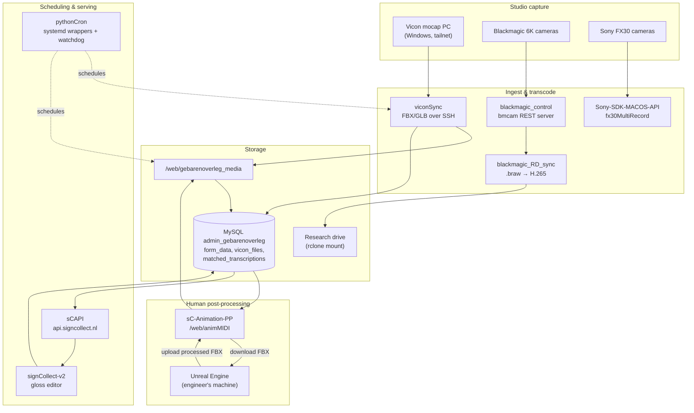

# SignCollect Stack

Index of the repositories behind **SignCollect / Zin** — the sign-language data
collection platform: studio capture, media processing, the gloss database, and
the public API.

There is no code here. This repo exists so a new developer can see, in one
place, what the repositories are, which of them talk to each other, and where
each one runs.

All of these repos live in the **Amsterdam-Humanities-Labs** organisation under
a `signlab_` name prefix. Every organisation member has access automatically —
there is nothing to request per repo. Prose in this document uses the short
names (`viconSync`, not `signlab_viconSync`) for readability; the table above
links each one to its actual location.

## The repositories

| Repo | Language | Role | Visibility |
|---|---|---|---|
| [signlab_signCollect-v2](https://github.com/Amsterdam-Humanities-Labs/signlab_signCollect-v2) | JavaScript + PHP | Gloss management web interface | Private |
| [signlab_sCAPI](https://github.com/Amsterdam-Humanities-Labs/signlab_sCAPI) | PHP | Public read API — `api.signcollect.nl` | Private |
| [signlab_sC-Animation-PP](https://github.com/Amsterdam-Humanities-Labs/signlab_sC-Animation-PP) | PHP | Mocap animation post-processing manager | Private |
| [signlab_pythonCron](https://github.com/Amsterdam-Humanities-Labs/signlab_pythonCron) | Python | Scheduler + watchdog for every recurring job | Private |
| [signlab_viconSync](https://github.com/Amsterdam-Humanities-Labs/signlab_viconSync) | Python | Vicon mocap capture → storage → database | Private |
| [signlab_blackmagic_control](https://github.com/Amsterdam-Humanities-Labs/signlab_blackmagic_control) | Python | `bmcam` — control Blackmagic cameras over REST | Private |
| [signlab_blackmagic_RD_sync](https://github.com/Amsterdam-Humanities-Labs/signlab_blackmagic_RD_sync) | Python | Blackmagic clips → H.265 → research drive | Private |
| [signlab_Sony-SDK-MACOS-API](https://github.com/Amsterdam-Humanities-Labs/signlab_Sony-SDK-MACOS-API) | C++ | Multi-camera controller for Sony FX30 on macOS | **Public** |
| [signlab_hh](https://github.com/Amsterdam-Humanities-Labs/signlab_hh) | HTML + Python | Dutch health-content indexing — **dormant** | Private |

Activity as of 2026-08-17: `viconSync` and `pythonCron` are actively worked on;
`signCollect-v2` last changed 2026-07-06; `blackmagic_RD_sync` 2026-05-08 and
`blackmagic_control` 2026-05-06; `sC-Animation-PP` 2026-04-24; `Sony-SDK-MACOS-API`
2026-02-23; `sCAPI` 2026-02-10. `hh` has not been touched since 2025-07-04.

## How they fit together

The chain in words: cameras and the mocap rig produce raw media → the ingest
repos pull it off the devices, transcode it and land it on shared storage →
`pythonCron` drives the recurring matching/conversion jobs that turn files into
database rows → engineers take FBX captures out through `sC-Animation-PP`,
clean them up in Unreal and put them back → `sCAPI` serves the results and
`signCollect-v2` edits them.

`hh` is not in this diagram: it reads the same database but is not part of the
capture-to-API path, and has been dormant since July 2025.

## What each one does

### signlab_signCollect-v2 — gloss management interface

A from-scratch rebuild of the gloss editor (`/web/menu_beta/`). Browse and edit
glosses from the `form_data` table: paginated table, filters, inline editing,
self-capture video recording, and studio videos linked through
`matched_transcriptions.m_transcription = form_data.id`.

- `php_api/` — the backend endpoints (`glosses_list`, `glosses_save`,
  `lsm_video_upload`, `phonology_get`, `logbook_get`, …)
- `signbank_sync/` — two-way sync with Signbank (`push_gloss`, `fetch_gloss`,
  `force_pull`, `force_push`)
- `docs/spec.md` — the data model, worth reading before touching `form_data`
- Auth is the shared `sessionObject` cookie on `.signcollect.nl`

### signlab_sCAPI — the public API

Read API over the sign video collection at `https://api.signcollect.nl`.
Search across words, sentences and glosses, with theme grouping and pagination;
plus the `getList*` / `get*Videos` endpoints. Single-word queries use
lemma-based search, multi-word queries require all words to match.

### signlab_sC-Animation-PP — animation post-processing manager

The human step in the mocap pipeline. Engineers download original FBX captures,
clean them up in Unreal Engine, and upload the processed versions back; the app
tracks who has which capture date and what state each file is in.

- Deploys to `/web/animMIDI`; PHP 7.4+ MVC with PDO, Tailwind via CDN, no build
  step
- Reads the `vicon_files` table — the `unreal/CC` subdirectory of what
  `viconSync` lands on disk, which is what ties this repo to the capture side
- Admins delegate a capture date to one user; downloads, uploads and status
  changes are all logged with timestamps
- BabylonJS viewer for 3D preview, plus side-by-side original vs processed
  comparison with per-bone rotation compensation

### signlab_pythonCron — scheduling and supervision

Runs every recurring job on the production host and restarts the ones that
fail. Two schedulers currently run side by side (a deliberate, transitional
state):

- **Wrapper architecture** (current direction) — one long-lived process and one
  systemd unit per service, driven by `services_config.json`, supervised by
  `watchdog_daemon.py`
- **Centralized scheduler v2** — the older `scheduler_v2.py` path with
  `config.json`

Roughly 16 services: media conversion, mocap record matching (`matchVicon.py`,
`matchRecords.py`), MySQL backups, EAF/SRT backups, lemma lookup, disk checks,
QR conversion. **This repo mirrors a live production system** — read its
operational notes before running anything.

### signlab_viconSync — Vicon mocap pipeline

Pulls motion-capture output off the Vicon PC and gets it into storage and the
database. The Vicon PC rejoins the tailnet under a new address after every
Windows reinstall, so nothing is pinned: `vicon_host.py` discovers it at
runtime from `tailscale status`.

- `sync_vicon_rsync.py` — the primary sync (SCP over SSH), `E:\Recordings` and
  `D:\PostExports\FBX` → `/web/gebarenoverleg_media/fbx`
- `ftp_monitor.py` — watches the Vicon FTP share for new recordings
- `glb_matcher.py` — pairs FBX files with their GLB counterparts
- `compress_blackmagic.py` — transcodes studio Blackmagic 6K clips to 1080p
  H.265 "mini" copies
- `cleanup_vicon.py` — reclaims space on the Vicon PC

Scheduled by `pythonCron`, which invokes `sync_vicon_rsync.py` directly.

### signlab_blackmagic_control — `bmcam`

CLI and Python library for a Blackmagic camera's Camera Control REST API
(a 6K Pro by default): recording start/stop, video format, media listing,
clip download. The camera serves port 80 but 404s on everything until **Web
Media Manager** and **REST API** are switched on — that one-time setup step is
the usual first stumble.

### signlab_blackmagic_RD_sync — camera → research drive

Autonomous cycle that moves every `.braw` off the camera's USB disk: download
through the `bmcam` server, transcode to H.265 via the Blackmagic RAW SDK piped
into ffmpeg's `hevc_videotoolbox`, upload to the research drive, verify, then
delete the source from the camera.

Two details that matter: the clip's **start timecode** is carried into the MP4
as a SMPTE `tmcd` track so editorial sync survives, and verification checks the
file is **durable upstream** rather than merely sitting in the rclone VFS
write-back cache before anything is deleted. Undecodable clips are archived as
the original `.braw` instead of being dropped. The pipeline is idempotent and
resume-aware.

Depends on `blackmagic_control` being up — it is the client of that REST server.

### signlab_Sony-SDK-MACOS-API — FX30 multi-camera control

`fx30MultiRecord`: a REST API plus embedded HTML dashboard for driving several
Sony FX30 cameras over USB from macOS — synchronised record start/stop, property
monitoring, media formatting, file download, and settings presets. Built on the
Sony Camera Remote SDK; the repo also documents the SDK connection patterns.

The only public repo here, and the only C++ one.

### signlab_hh — Dutch health-content indexing (dormant)

Crawls medical content from `thuisarts.nl`, lemmatises it with OpenDutchWordnet,
and presents it through a browsing/search interface: `crawl.py` →
`json_to_db.py` → `create_unique_words_table.py` → `lemma_load.py`, with
autocue and concept-list pages on top.

It sits at the edge of the stack rather than inside it. The link is vocabulary:
it queries glosses across Signbank and SignCollect in the same
`admin_gebarenoverleg` database, and its lemma work overlaps with the
`convert_zinString_to_LemmaList` job `pythonCron` runs. Nothing in the live
capture-to-API path depends on it.

All of its commits land on a single day, 2025-07-04. Its ~110 MB is mostly the
vendored `OpenDutchWordnet` tree, not project code. Treat it as an archive: read
it for the crawler and lemmatisation approach, don't expect it to run as-is.

## Cross-cutting things worth knowing

**Health monitoring.** Long-running scripts register with the Client Monitor API
at `https://signcollect.nl/client_monitor_api/api.php` and send heartbeats with
stats; missing heartbeats are how a silently dead job gets noticed. Client IDs
follow a `vicon-*` style convention (`vicon-sync-rsync`, `vicon-ftp-monitor`,
`vicon-glb-matcher`, `vicon-blackmagic-mini`). Monitoring is always optional —
if the API is unreachable the script logs a warning and continues, and sync work
is never blocked by a monitoring failure.

The `ClientMonitor` class lives in a `python_client.py` that has been **copied**
into each repo rather than shared. The copies have already drifted. If you touch
one, check whether the others need the same change — and it is a reasonable
candidate for extraction into a real package.

**Conventions.** Every repo defaults to `main`. Most carry a `CLAUDE.md` with
repo-specific working notes. Production runs under systemd on the main host,
with units either hand-written or generated by `pythonCron`'s
`wrapper_generator.py`.

**Credentials.** The intended pattern: config files holding passwords are
gitignored, with a committed `*.example.*` template alongside. `viconSync`
follows it — its password comes from `vicon_credentials.get_vicon_password()`
(`$VICON_PASSWORD`, or the untracked `monitor_config.json`) and appears nowhere
in the repo or its history.

Every repo now follows it. On 2026-08-19 the `admin_gebarenoverleg` MySQL
password was found committed in plaintext in 58 files across seven repos, and
was purged from all of them — working files and full git history:

| Repo | Files | How it was purged |
|---|---|---|
| `signlab_zin` | 26 | history replaced; reads `db_credentials.py` |
| `signlab_hh` | 16 | history replaced; reads `db_credentials.{py,php}` |
| `signlab_mocap` | 7 | history replaced; reads `db_credentials.py` |
| `signlab_client_monitor_api` | 3 | history replaced; docs redacted |
| `signlab_sC-Animation-PP` | 3+1 | path purged from history via filter-repo |
| `signlab_sCAPI` | 2 | `mysql_config.php` untracked + purged |
| `signlab_viconSync` | 1 | path purged from history via filter-repo |

Each affected repo now carries a gitignored `db_credentials.py` (and
`db_credentials.php` where PHP needs it) with a committed `*.example.*`
template beside it. Deploying to a new host means copying the example and
filling in the password.

**The credential still needs rotating.** It was readable by all organisation
members before the purge, so treat it as compromised regardless of the rewrite.
Rotation is now a one-line change per host instead of an edit across 58 files.

**Shared storage paths.** `/web/gebarenoverleg_media` is the media root on the
production host (`fbx/`, `studioFiles/`); the research drive is reached through
an rclone mount. Several repos hardcode these absolute paths.

## Adding a repo to this index

Add a row to the table, a subsection under "What each one does", and — if it
moves data between existing components — an edge in the diagram. Keep the
descriptions about *what the thing is for* and *how it connects*; anything that
is only true inside one repo belongs in that repo's own README.
