# SignCollect Stack

Index of the repositories behind **SignCollect / Zin** — the sign-language data
collection platform: studio capture, media processing, the gloss database, and
the public API.

There is no code here. This repo exists so a new developer can see, in one
place, what the repositories are, which of them talk to each other, and where
each one runs.

> 📖 **[Read the Manual →](MANUAL.md)**
> Every repository in one document: what it is for, **live links you can try
> right now**, how to use each interface, the endpoints behind it, and a
> troubleshooting section. This README is the map; the manual is the handbook.

All of these repos live in the **Amsterdam-Humanities-Labs** organisation under
a `signlab_` name prefix. Every organisation member has access automatically —
there is nothing to request per repo. Prose in this document uses the short
names (`viconSync`, not `signlab_viconSync`) for readability; the tables link
each one to its actual location.

The index covers **27 repositories**, all in the single table below. The `Layer`
column separates the nine **core stack** repos — the ones that carry data from
camera to API, documented in depth further down — from the eighteen web tools
and services built on top of that data.

## The repositories

Every repo is private except `signlab_Sony-SDK-MACOS-API`. The nine in the
**core stack** carry data along the camera-to-API path and are documented in
depth further down; the rest are web tools and services built on top of that
data, deployed under `/web/<name>` where the directory is the repo name minus
the `signlab_` prefix.

| Repo | Layer | Language | Role |
|---|---|---|---|
| [signlab_viconSync](https://github.com/Amsterdam-Humanities-Labs/signlab_viconSync) | Core stack | Python | Vicon mocap capture → storage → database |
| [signlab_blackmagic_control](https://github.com/Amsterdam-Humanities-Labs/signlab_blackmagic_control) | Core stack | Python | `bmcam` — control Blackmagic cameras over REST |
| [signlab_blackmagic_RD_sync](https://github.com/Amsterdam-Humanities-Labs/signlab_blackmagic_RD_sync) | Core stack | Python | Blackmagic clips → H.265 → research drive |
| [signlab_Sony-SDK-MACOS-API](https://github.com/Amsterdam-Humanities-Labs/signlab_Sony-SDK-MACOS-API) | Core stack | C++ | Multi-camera controller for Sony FX30 on macOS — **the one public repo** |
| [signlab_pythonCron](https://github.com/Amsterdam-Humanities-Labs/signlab_pythonCron) | Core stack | Python | Scheduler + watchdog for every recurring job |
| [signlab_sC-Animation-PP](https://github.com/Amsterdam-Humanities-Labs/signlab_sC-Animation-PP) | Core stack | PHP | Mocap animation post-processing manager |
| [signlab_sCAPI](https://github.com/Amsterdam-Humanities-Labs/signlab_sCAPI) | Core stack | PHP | Public read API — `api.signcollect.nl` |
| [signlab_signCollect-v2](https://github.com/Amsterdam-Humanities-Labs/signlab_signCollect-v2) | Core stack | JavaScript + PHP | Gloss management web interface |
| [signlab_hh](https://github.com/Amsterdam-Humanities-Labs/signlab_hh) | Core stack | HTML + Python | Dutch health-content indexing — **dormant** |
| [signlab_zin](https://github.com/Amsterdam-Humanities-Labs/signlab_zin) | Annotation | PHP + Python | The main annotation tool — synchronise Dutch text, Signbank glosses and video into subtitle/gloss tracks. The largest repo here |
| [signlab_annotation-tool](https://github.com/Amsterdam-Humanities-Labs/signlab_annotation-tool) | Annotation | JavaScript | Browser-only multi-tier timeline editor that saves ELAN `.eaf` files. No server component |
| [signlab_annotation-editors](https://github.com/Amsterdam-Humanities-Labs/signlab_annotation-editors) | Annotation | PHP | Self-contained extracts of the two production editors (`subBeta8`, `3DAnn2`) lifted out of `zin` |
| [signlab_mocapStudio](https://github.com/Amsterdam-Humanities-Labs/signlab_mocapStudio) | Studio & mocap | PHP | Motion Capture Studio UI — 3D recording pages, sentence/video checks, capture stats |
| [signlab_studioIndex](https://github.com/Amsterdam-Humanities-Labs/signlab_studioIndex) | Studio & mocap | PHP | Studio Index — browse the studio archive by date with per-date completion status |
| [signlab_studio_beta](https://github.com/Amsterdam-Humanities-Labs/signlab_studio_beta) | Studio & mocap | PHP | Camera Control — FX30 capture control, proxying, and capture/debug logs |
| [signlab_mocap](https://github.com/Amsterdam-Humanities-Labs/signlab_mocap) | Studio & mocap | Python + PHP | Motion Capture NGT Recordings — capture lists, record matching, CSV/JSON→SQL importers |
| [signlab_mocap_lab](https://github.com/Amsterdam-Humanities-Labs/signlab_mocap_lab) | Studio & mocap | PHP | Lab capture endpoints and reference media (images, topics, FBX uploads) |
| [signlab_mocapDataPackage](https://github.com/Amsterdam-Humanities-Labs/signlab_mocapDataPackage) | Studio & mocap | PHP | Upload endpoint that receives and stores large zip packages of capture data |
| [signlab_viconDashboard](https://github.com/Amsterdam-Humanities-Labs/signlab_viconDashboard) | Studio & mocap | PHP + JS | Real-time dashboard for Vicon sessions — capture status, file completions, 3D viewer links |
| [mocap_site](https://github.com/Amsterdam-Humanities-Labs/mocap_site) | Studio & mocap | HTML | Single-page Motion Capture Portal entry point. **Not yet renamed** — see the note below |
| [signlab_videoFix](https://github.com/Amsterdam-Humanities-Labs/signlab_videoFix) | Video | PHP | Crop Fix Manager — track and apply per-video crop corrections |
| [signlab_videoBackgroundFix](https://github.com/Amsterdam-Humanities-Labs/signlab_videoBackgroundFix) | Video | PHP | Background and framing correction for studio clips, with preview frames and a job queue |
| [signlab_s3b_glb](https://github.com/Amsterdam-Humanities-Labs/signlab_s3b_glb) | 3D & assets | PHP | GLB viewer over the sign collection, backed by gloss and sense caches |
| [signlab_s3b_server](https://github.com/Amsterdam-Humanities-Labs/signlab_s3b_server) | 3D & assets | PHP + Python | SAM3D-body upload and hand-cluster clustering server, with a cluster viewer |
| [signlab_s3b_viewer](https://github.com/Amsterdam-Humanities-Labs/signlab_s3b_viewer) | 3D & assets | PHP | Standalone SAM 3D Body viewer over a small file API |
| [signlab_mhr](https://github.com/Amsterdam-Humanities-Labs/signlab_mhr) | 3D & assets | — | MHR avatar mesh/animation sources. The binaries exceed GitHub's 100 MB limit and are gitignored; the repo README covers the Git LFS setup |
| [signlab_client_monitor_api](https://github.com/Amsterdam-Humanities-Labs/signlab_client_monitor_api) | Monitoring | PHP + Python | Registration and heartbeat API for long-running scripts and cron jobs |
| [signlab_client_monitor_dashboard](https://github.com/Amsterdam-Humanities-Labs/signlab_client_monitor_dashboard) | Monitoring | PHP + JS | Dashboard UI over the client monitor API |

**`mocap_site` is the one repo without the prefix.** It was transferred into the
organisation before the rename convention was applied, and renaming a repo
requires organisation-owner rights. An owner needs to rename it to
`signlab_mocap_site`; afterwards run
`git -C /web/mocap_site remote set-url origin git@github.com:Amsterdam-Humanities-Labs/signlab_mocap_site.git`.

Activity as of 2026-08-17, before the migration: `viconSync` and `pythonCron`
are actively worked on; `signCollect-v2` last changed 2026-07-06;
`blackmagic_RD_sync` 2026-05-08 and `blackmagic_control` 2026-05-06;
`sC-Animation-PP` 2026-04-24; `Sony-SDK-MACOS-API` 2026-02-23; `sCAPI`
2026-02-10. `hh` has not been touched since 2025-07-04.

> GitHub's "last pushed" timestamps are no longer a guide to real activity. The
> August 2026 move into the organisation, and the credential purge that went
> with it, rewrote history on several repos and stamped them all with recent
> dates. Use the dates above, or each repo's own commit log, instead.

## How they fit together

Hardware is on the left of each row, the thing that reads it on the right.
**Every repo node is clickable** — it opens that repository. Dashed edges are
scheduling ("this triggers that"); solid edges are data moving.

```mermaid
flowchart TB
    subgraph capture["🎥 Capture — hardware on the studio floor"]
        vicon["<b>Vicon mocap PC</b><br/>Windows, on the tailnet<br/>skeleton capture → FBX/GLB"]
        bm["<b>Blackmagic 6K cameras</b><br/>.braw onto a USB disk"]
        sony["<b>Sony FX30 cameras</b><br/>USB to an operator's Mac"]
    end

    subgraph control["🎛️ Session control — what an operator has open"]
        ms["<b>mocapStudio</b><br/>3dOpname — shows the sentence<br/>to sign, logs every take"]
        sb["<b>studio_beta</b><br/>Camera Control — starts/stops<br/>takes, keeps the session log"]
        ssdk["<b>Sony-SDK-MACOS-API</b><br/>fx30MultiRecord on :8080<br/>broadcasts record to all cameras"]
        bmc["<b>blackmagic_control</b><br/>bmcam — REST control of the 6K"]
    end

    subgraph ingest["📥 Ingest — getting media off the devices"]
        vs["<b>viconSync</b><br/>SCP over SSH, rediscovers the<br/>Vicon PC via tailscale each run"]
        rd["<b>blackmagic_RD_sync</b><br/>.braw → H.265, keeps SMPTE<br/>timecode, verifies then deletes"]
        mdp["<b>mocapDataPackage</b><br/>upload.php — receives zipped<br/>capture packages"]
    end

    subgraph store["💾 Storage and database"]
        web["<b>/web/gebarenoverleg_media</b><br/>fbx/ · razerFiles/ · shogun_live/"]
        drive["<b>Research drive</b><br/>rclone mount"]
        db[("<b>MySQL admin_gebarenoverleg</b><br/>form_data · sentences<br/>vicon_captures · vicon_files<br/>matched_transcriptions")]
    end

    subgraph cronly["⏱️ Scheduling"]
        cron["<b>pythonCron</b><br/>~16 services, systemd wrappers<br/>+ watchdog. Matches recordings<br/>to sentences, backs up, converts"]
    end

    subgraph review["🔍 Review — is the material complete?"]
        vd["<b>viconDashboard</b><br/>live capture status<br/>🟢 complete 🟡 still growing 🔴 missing"]
        si["<b>studioIndex</b><br/>browse the archive by date"]
        mc["<b>mocap</b><br/>capture register + importers"]
    end

    subgraph fix["🎬 Media correction"]
        vf["<b>videoFix</b><br/>per-video crop corrections"]
        vbf["<b>videoBackgroundFix</b><br/>reframe + background,<br/>preview then queue the job"]
    end

    subgraph post["🧍 Human post-processing"]
        app["<b>sC-Animation-PP</b><br/>delegates a capture date to one<br/>engineer, logs every transfer"]
        ue["<b>Unreal Engine</b><br/>on the engineer's machine"]
    end

    subgraph annot["✍️ Annotation — where researchers work"]
        zin["<b>zin</b><br/>the main tool — Dutch text,<br/>Signbank glosses and sign-by-sign<br/>against a video timeline → EAF/SRT"]
        at["<b>annotation-tool</b><br/>browser-only, no login,<br/>nothing uploaded"]
        ae["<b>annotation-editors</b><br/>the two editors, extracted<br/>to run standalone"]
    end

    subgraph serve["🌐 Serving"]
        api["<b>sCAPI</b><br/>api.signcollect.nl — read API,<br/>lemma search over the collection"]
        ui["<b>signCollect-v2</b><br/>gloss editor, syncs with Signbank"]
    end

    subgraph view3d["🧊 3D viewers"]
        glb["<b>s3b_glb</b><br/>GLB viewer, cache-backed"]
        s3s["<b>s3b_server</b><br/>SAM3D upload + hand clustering"]
        s3v["<b>s3b_viewer</b><br/>minimal standalone viewer"]
    end

    subgraph mon["📡 Monitoring"]
        cma["<b>client_monitor_api</b><br/>register + heartbeat.<br/>Never blocks the job it watches"]
        cmd["<b>client_monitor_dashboard</b><br/>online · warning · offline"]
    end

    sony --> ssdk --> sb
    bm --> bmc --> rd --> drive
    vicon --> vs --> web
    ms --> db
    sb --> db
    vs --> db
    mdp --> web

    cron -.schedules.-> vs
    cron -.schedules.-> web
    cron -.matches recordings.-> db

    web --> db
    db --> vd
    db --> si
    db --> mc
    web --> vf --> web
    web --> vbf --> web

    db --> app
    app -- "download FBX" --> ue
    ue -- "upload processed FBX" --> app
    app --> web

    db --> zin --> db
    zin -.launches.-> ae
    web --> glb
    web --> s3s
    web --> s3v

    db --> api --> ui --> db

    vs -.heartbeat.-> cma
    rd -.heartbeat.-> cma
    cron -.heartbeat.-> cma
    cma --> cmd

    click ms "https://github.com/Amsterdam-Humanities-Labs/signlab_mocapStudio" "mocapStudio"
    click sb "https://github.com/Amsterdam-Humanities-Labs/signlab_studio_beta" "studio_beta"
    click ssdk "https://github.com/Amsterdam-Humanities-Labs/signlab_Sony-SDK-MACOS-API" "Sony-SDK-MACOS-API"
    click bmc "https://github.com/Amsterdam-Humanities-Labs/signlab_blackmagic_control" "blackmagic_control"
    click vs "https://github.com/Amsterdam-Humanities-Labs/signlab_viconSync" "viconSync"
    click rd "https://github.com/Amsterdam-Humanities-Labs/signlab_blackmagic_RD_sync" "blackmagic_RD_sync"
    click mdp "https://github.com/Amsterdam-Humanities-Labs/signlab_mocapDataPackage" "mocapDataPackage"
    click cron "https://github.com/Amsterdam-Humanities-Labs/signlab_pythonCron" "pythonCron"
    click vd "https://github.com/Amsterdam-Humanities-Labs/signlab_viconDashboard" "viconDashboard"
    click si "https://github.com/Amsterdam-Humanities-Labs/signlab_studioIndex" "studioIndex"
    click mc "https://github.com/Amsterdam-Humanities-Labs/signlab_mocap" "mocap"
    click vf "https://github.com/Amsterdam-Humanities-Labs/signlab_videoFix" "videoFix"
    click vbf "https://github.com/Amsterdam-Humanities-Labs/signlab_videoBackgroundFix" "videoBackgroundFix"
    click app "https://github.com/Amsterdam-Humanities-Labs/signlab_sC-Animation-PP" "sC-Animation-PP"
    click zin "https://github.com/Amsterdam-Humanities-Labs/signlab_zin" "zin"
    click at "https://github.com/Amsterdam-Humanities-Labs/signlab_annotation-tool" "annotation-tool"
    click ae "https://github.com/Amsterdam-Humanities-Labs/signlab_annotation-editors" "annotation-editors"
    click api "https://github.com/Amsterdam-Humanities-Labs/signlab_sCAPI" "sCAPI"
    click ui "https://github.com/Amsterdam-Humanities-Labs/signlab_signCollect-v2" "signCollect-v2"
    click glb "https://github.com/Amsterdam-Humanities-Labs/signlab_s3b_glb" "s3b_glb"
    click s3s "https://github.com/Amsterdam-Humanities-Labs/signlab_s3b_server" "s3b_server"
    click s3v "https://github.com/Amsterdam-Humanities-Labs/signlab_s3b_viewer" "s3b_viewer"
    click cma "https://github.com/Amsterdam-Humanities-Labs/signlab_client_monitor_api" "client_monitor_api"
    click cmd "https://github.com/Amsterdam-Humanities-Labs/signlab_client_monitor_dashboard" "client_monitor_dashboard"
```

### The chain in words

**Recording.** An operator opens `mocapStudio` to see which sentence to capture
and `studio_beta` to run the cameras. `studio_beta` proxies to
`Sony-SDK-MACOS-API`, which holds the USB connections to all the FX30s and
broadcasts a single record command — there is no per-camera addressing, which is
exactly why the process exists. The Vicon rig and the Blackmagic cameras record
alongside them.

**Ingest.** Nothing is pulled by hand. `viconSync` copies skeleton output off
the Vicon PC (rediscovering its tailnet address every run, because a Windows
reinstall changes it), `blackmagic_RD_sync` clears the 6K's USB disk by
transcoding to H.265 and only deleting once the file is verified durable
upstream, and `mocapDataPackage` accepts zipped packages posted from capture
machines. Everything lands under `/web/gebarenoverleg_media` or the research
drive.

**Turning files into rows.** `pythonCron` runs the recurring work — matching
recordings to sentences, backups, conversions — and restarts anything that
dies. This is where loose files become `vicon_files` and `matched_transcriptions`
records.

**Checking and fixing.** `viconDashboard` is the live view of whether a session
is complete; `studioIndex` and `mocap` are the by-date and register views. Where
framing is wrong, `videoFix` records crop corrections and `videoBackgroundFix`
reframes clips through a preview-then-queue workflow.

**The human step.** `sC-Animation-PP` hands one capture date to one engineer,
who cleans the FBX up in Unreal and uploads it back. Every transfer is logged —
the audit trail matters as much as the file.

**Annotation.** `zin` is where the linguistic work happens: Dutch text, Signbank
glosses and sign-by-sign annotation lined up against the video, exported as EAF
and SRT. `annotation-editors` is the same two editors extracted to run
standalone. `annotation-tool` is the escape hatch — browser-only, no login,
nothing uploaded, for material that is not in the database.

**Serving.** `sCAPI` publishes the collection at `api.signcollect.nl` and
`signCollect-v2` is the gloss editor over `form_data`, syncing two ways with
Signbank.

**Watching all of it.** Long-running scripts register with `client_monitor_api`
and heartbeat; `client_monitor_dashboard` shows who has gone quiet. Monitoring is
deliberately never fatal — if the API is unreachable a job logs a warning and
carries on.

`hh` is not in this diagram. It reads the same database but sits outside the
capture-to-API path and has been dormant since July 2025. `mhr` is not in it
either — it is avatar source assets, not a running service.

## What each one does

### signlab_signCollect-v2 — gloss management interface

A from-scratch rebuild of the gloss editor (`/web/menu_beta/`). Browse and edit
glosses from the `form_data` table: paginated table, filters, inline editing,
self-capture video recording, and studio videos linked through
`matched_transcriptions.m_transcription = form_data.id`.

- `php_api/` — the backend endpoints (`glosses_list`, `glosses_save`,
  `lsm_video_upload`, `phonology_get`, `logbook_get`, …)
- `signbank_sync/` — two-way sync with Signbank (`push_gloss`, `fetch_gloss`,
  `force_pull`, `force_push`)
- `docs/spec.md` — the data model, worth reading before touching `form_data`
- Auth is the shared `sessionObject` cookie on `.signcollect.nl`

### signlab_sCAPI — the public API

Read API over the sign video collection at `https://api.signcollect.nl`.
Search across words, sentences and glosses, with theme grouping and pagination;
plus the `getList*` / `get*Videos` endpoints. Single-word queries use
lemma-based search, multi-word queries require all words to match.

### signlab_sC-Animation-PP — animation post-processing manager

The human step in the mocap pipeline. Engineers download original FBX captures,
clean them up in Unreal Engine, and upload the processed versions back; the app
tracks who has which capture date and what state each file is in.

- Deploys to `/web/animMIDI`; PHP 7.4+ MVC with PDO, Tailwind via CDN, no build
  step
- Reads the `vicon_files` table — the `unreal/CC` subdirectory of what
  `viconSync` lands on disk, which is what ties this repo to the capture side
- Admins delegate a capture date to one user; downloads, uploads and status
  changes are all logged with timestamps
- BabylonJS viewer for 3D preview, plus side-by-side original vs processed
  comparison with per-bone rotation compensation

### signlab_pythonCron — scheduling and supervision

Runs every recurring job on the production host and restarts the ones that
fail. Two schedulers currently run side by side (a deliberate, transitional
state):

- **Wrapper architecture** (current direction) — one long-lived process and one
  systemd unit per service, driven by `services_config.json`, supervised by
  `watchdog_daemon.py`
- **Centralized scheduler v2** — the older `scheduler_v2.py` path with
  `config.json`

Roughly 16 services: media conversion, mocap record matching (`matchVicon.py`,
`matchRecords.py`), MySQL backups, EAF/SRT backups, lemma lookup, disk checks,
QR conversion. **This repo mirrors a live production system** — read its
operational notes before running anything.

### signlab_viconSync — Vicon mocap pipeline

Pulls motion-capture output off the Vicon PC and gets it into storage and the
database. The Vicon PC rejoins the tailnet under a new address after every
Windows reinstall, so nothing is pinned: `vicon_host.py` discovers it at
runtime from `tailscale status`.

- `sync_vicon_rsync.py` — the primary sync (SCP over SSH), `E:\Recordings` and
  `D:\PostExports\FBX` → `/web/gebarenoverleg_media/fbx`
- `ftp_monitor.py` — watches the Vicon FTP share for new recordings
- `glb_matcher.py` — pairs FBX files with their GLB counterparts
- `compress_blackmagic.py` — transcodes studio Blackmagic 6K clips to 1080p
  H.265 "mini" copies
- `cleanup_vicon.py` — reclaims space on the Vicon PC

Scheduled by `pythonCron`, which invokes `sync_vicon_rsync.py` directly.

### signlab_blackmagic_control — `bmcam`

CLI and Python library for a Blackmagic camera's Camera Control REST API
(a 6K Pro by default): recording start/stop, video format, media listing,
clip download. The camera serves port 80 but 404s on everything until **Web
Media Manager** and **REST API** are switched on — that one-time setup step is
the usual first stumble.

### signlab_blackmagic_RD_sync — camera → research drive

Autonomous cycle that moves every `.braw` off the camera's USB disk: download
through the `bmcam` server, transcode to H.265 via the Blackmagic RAW SDK piped
into ffmpeg's `hevc_videotoolbox`, upload to the research drive, verify, then
delete the source from the camera.

Two details that matter: the clip's **start timecode** is carried into the MP4
as a SMPTE `tmcd` track so editorial sync survives, and verification checks the
file is **durable upstream** rather than merely sitting in the rclone VFS
write-back cache before anything is deleted. Undecodable clips are archived as
the original `.braw` instead of being dropped. The pipeline is idempotent and
resume-aware.

Depends on `blackmagic_control` being up — it is the client of that REST server.

### signlab_Sony-SDK-MACOS-API — FX30 multi-camera control

`fx30MultiRecord`: a REST API plus embedded HTML dashboard for driving several
Sony FX30 cameras over USB from macOS — synchronised record start/stop, property
monitoring, media formatting, file download, and settings presets. Built on the
Sony Camera Remote SDK; the repo also documents the SDK connection patterns.

The only public repo here, and the only C++ one.

### signlab_hh — Dutch health-content indexing (dormant)

Crawls medical content from `thuisarts.nl`, lemmatises it with OpenDutchWordnet,
and presents it through a browsing/search interface: `crawl.py` →
`json_to_db.py` → `create_unique_words_table.py` → `lemma_load.py`, with
autocue and concept-list pages on top.

It sits at the edge of the stack rather than inside it. The link is vocabulary:
it queries glosses across Signbank and SignCollect in the same
`admin_gebarenoverleg` database, and its lemma work overlaps with the
`convert_zinString_to_LemmaList` job `pythonCron` runs. Nothing in the live
capture-to-API path depends on it.

All of its commits land on a single day, 2025-07-04. Its ~110 MB is mostly the
vendored `OpenDutchWordnet` tree, not project code. Treat it as an archive: read
it for the crawler and lemmatisation approach, don't expect it to run as-is.

## Cross-cutting things worth knowing

**Health monitoring.** Long-running scripts register with the Client Monitor API
at `https://signcollect.nl/client_monitor_api/api.php` and send heartbeats with
stats; missing heartbeats are how a silently dead job gets noticed. Client IDs
follow a `vicon-*` style convention (`vicon-sync-rsync`, `vicon-ftp-monitor`,
`vicon-glb-matcher`, `vicon-blackmagic-mini`). Monitoring is always optional —
if the API is unreachable the script logs a warning and continues, and sync work
is never blocked by a monitoring failure.

The `ClientMonitor` class lives in a `python_client.py` that has been **copied**
into each repo rather than shared. The copies have already drifted. If you touch
one, check whether the others need the same change — and it is a reasonable
candidate for extraction into a real package.

**Conventions.** Every repo defaults to `main`. Most carry a `CLAUDE.md` with
repo-specific working notes. Production runs under systemd on the main host,
with units either hand-written or generated by `pythonCron`'s
`wrapper_generator.py`.

**Credentials.** The intended pattern: config files holding passwords are
gitignored, with a committed `*.example.*` template alongside. `viconSync`
follows it — its password comes from `vicon_credentials.get_vicon_password()`
(`$VICON_PASSWORD`, or the untracked `monitor_config.json`) and appears nowhere
in the repo or its history.

Every repo now follows it. On 2026-08-19 the `admin_gebarenoverleg` MySQL
password was found committed in plaintext in 58 files across seven repos, and
was purged from all of them — working files and full git history:

| Repo | Files | How it was purged |
|---|---|---|
| `signlab_zin` | 26 | history replaced; reads `db_credentials.py` |
| `signlab_hh` | 16 | history replaced; reads `db_credentials.{py,php}` |
| `signlab_mocap` | 7 | history replaced; reads `db_credentials.py` |
| `signlab_client_monitor_api` | 3 | history replaced; docs redacted |
| `signlab_sC-Animation-PP` | 3+1 | path purged from history via filter-repo |
| `signlab_sCAPI` | 2 | `mysql_config.php` untracked + purged |
| `signlab_viconSync` | 1 | path purged from history via filter-repo |

Each affected repo now carries a gitignored `db_credentials.py` (and
`db_credentials.php` where PHP needs it) with a committed `*.example.*`
template beside it. Deploying to a new host means copying the example and
filling in the password.

**The credential still needs rotating.** It was readable by all organisation
members before the purge, so treat it as compromised regardless of the rewrite.
Rotation is now a one-line change per host instead of an edit across 58 files.

**Shared storage paths.** `/web/gebarenoverleg_media` is the media root on the
production host (`fbx/`, `studioFiles/`); the research drive is reached through
an rclone mount. Several repos hardcode these absolute paths.

## Adding a repo to this index

Add a row to the table, grouped with the others sharing its `Layer`.

If it carries data along the camera-to-API path, mark it `Core stack` and also
add a subsection under "What each one does" plus an edge in the diagram. Any
other repo takes one of the remaining layers — `Annotation`, `Studio & mocap`,
`Video`, `3D & assets`, `Monitoring` — and needs the table row only. Introduce
a new layer only when a repo fits none of them.

Keep the description about *what the thing is for* and *how it connects*;
anything that is only true inside one repo belongs in that repo's own README.
New repos go into the organisation with a `signlab_` prefix.
