# How the repositories fit together

The path from capture to API. In each row, the hardware is on the left and
what reads from it is on the right. Every repo node links to its repository.
Dashed lines are scheduling. Solid lines are data moving. Which machine runs
what is in [machines.md](machines.md). The index is the [README](../README.md).

```mermaid
flowchart TB
    subgraph capture["Capture: hardware on the studio floor"]
        vicon["<b>Vicon mocap PC</b><br/>Windows, on the tailnet<br/>skeleton capture → FBX/GLB<br/><i>also runs bmcam + RD_sync</i>"]
        bm["<b>Blackmagic 6K cameras</b><br/>.braw onto a USB disk"]
        sony["<b>Sony FX30 cameras</b><br/>USB to DRS (macOS)"]
    end

    subgraph control["Session control: what an operator has open"]
        ms["<b>mocapStudio</b><br/>3dOpname: shows the sentence<br/>to sign, logs every take"]
        sb["<b>camera-control</b><br/>Camera Control: starts/stops<br/>takes, keeps the session log"]
        ssdk["<b>Sony-SDK-MACOS-API</b><br/>fx30MultiRecord on :8080<br/>broadcasts record to all cameras"]
        bmc["<b>blackmagic_control</b><br/>bmcam: REST control of the 6K"]
    end

    subgraph ingest["Ingest: getting media off the devices"]
        vs["<b>viconSync</b><br/>SCP over SSH, rediscovers the<br/>Vicon PC via tailscale each run"]
        rd["<b>blackmagic_RD_sync</b><br/>.braw → H.265, keeps SMPTE<br/>timecode, verifies then deletes"]
        mdp["<b>mocapDataPackage</b> (archived)<br/>upload.php: receives zipped<br/>capture packages"]
    end

    subgraph store["Storage and database"]
        web["<b>/web/gebarenoverleg_media</b><br/>fbx/ · razerFiles/ · shogun_live/"]
        drive["<b>Research drive</b><br/>rclone mount"]
        db[("<b>MySQL admin_gebarenoverleg</b><br/>form_data · sentences<br/>vicon_captures · vicon_files<br/>matched_transcriptions")]
    end

    subgraph cronly["Scheduling"]
        cron["<b>pythonCron</b><br/>20 wrapper units<br/>+ watchdog. Matches recordings<br/>to sentences, backs up, converts"]
    end

    subgraph review["Review: is the material complete?"]
        vd["<b>viconDashboard</b><br/>live capture status<br/>green complete, yellow still growing,<br/>red missing"]
        si["<b>studio-archive</b><br/>browse the archive by date"]
        mc["<b>mocap</b><br/>capture register + importers"]
    end

    subgraph fix["Media correction"]
        drs["<b>drs-pipeline</b><br/>on DRS: DaVinci render,<br/>AI crop, convert + upload"]
        vf["<b>crop-fix-manager</b><br/>per-video crop corrections"]
        vbf["<b>background-fix</b><br/>reframe + background,<br/>preview then queue the job"]
    end

    subgraph post["Human post-processing"]
        app["<b>mocap-postprocessing</b><br/>delegates a capture date to one<br/>engineer, logs every transfer"]
        ue["<b>Unreal Engine</b><br/>on the engineer's machine"]
    end

    subgraph annot["Annotation: where researchers work"]
        zin["<b>zinnen-annotation</b><br/>the main tool: Dutch text,<br/>Signbank glosses and sign-by-sign<br/>against a video timeline → EAF/SRT"]
        at["<b>annotation-tool</b><br/>browser-only, no login,<br/>nothing uploaded"]
        ae["<b>annotation-editors</b><br/>the two editors, extracted<br/>to run standalone"]
    end

    subgraph serve["Serving"]
        api["<b>signCollect-API-TYD</b><br/>api.signcollect.nl: read API,<br/>lemma search over the collection"]
        ui["<b>signCollect-v2</b><br/>gloss editor, syncs with Signbank"]
    end

    subgraph view3d["3D viewers"]
        glb["<b>body-animation-viewer</b><br/>GLB viewer, cache-backed"]
        s3s["<b>sam3d-body-queue</b><br/>SAM3D upload + hand clustering"]
        s3v["<b>s3b_viewer</b> (archived)<br/>minimal standalone viewer,<br/>now in sam3d-body-queue"]
    end

    subgraph mon["Monitoring"]
        cma["<b>client_monitor_api</b><br/>register + heartbeat.<br/>Never blocks the job it watches"]
        cmd["<b>client_monitor_dashboard</b><br/>online · warning · offline"]
    end

    sony --> ssdk --> sb
    bm --> bmc --> rd --> drive
    vicon --> vs --> web
    ms --> db
    sb --> db
    vs --> db
    mdp --> web

    cron -.schedules.-> vs
    cron -.schedules.-> web
    cron -.matches recordings.-> db

    web --> db
    db --> vd
    db --> si
    db --> mc
    web --> vf --> web
    web --> vbf --> web
    sony --> drs --> drive
    drs --> web

    db --> app
    app -- "download FBX" --> ue
    ue -- "upload processed FBX" --> app
    app --> web

    db --> zin --> db
    zin -.launches.-> ae
    web --> glb
    web --> s3s
    web --> s3v

    db --> api --> ui --> db

    vs -.heartbeat.-> cma
    rd -.heartbeat.-> cma
    cron -.heartbeat.-> cma
    cma --> cmd

    click ms "https://github.com/Amsterdam-Humanities-Labs/signlab_mocapStudio" "mocapStudio"
    click sb "https://github.com/Amsterdam-Humanities-Labs/signlab_camera-control" "camera-control"
    click ssdk "https://github.com/Amsterdam-Humanities-Labs/signlab_Sony-SDK-MACOS-API" "Sony-SDK-MACOS-API"
    click bmc "https://github.com/Amsterdam-Humanities-Labs/signlab_blackmagic_control" "blackmagic_control"
    click vs "https://github.com/Amsterdam-Humanities-Labs/signlab_viconSync" "viconSync"
    click rd "https://github.com/Amsterdam-Humanities-Labs/signlab_blackmagic_RD_sync" "blackmagic_RD_sync"
    click mdp "https://github.com/Amsterdam-Humanities-Labs/signlab_mocapDataPackage" "mocapDataPackage (archived)"
    click cron "https://github.com/Amsterdam-Humanities-Labs/signlab_pythonCron" "pythonCron"
    click vd "https://github.com/Amsterdam-Humanities-Labs/signlab_viconDashboard" "viconDashboard"
    click si "https://github.com/Amsterdam-Humanities-Labs/signlab_studio-archive" "studio-archive"
    click mc "https://github.com/Amsterdam-Humanities-Labs/signlab_mocap" "mocap"
    click drs "https://github.com/Amsterdam-Humanities-Labs/signlab_drs-pipeline" "drs-pipeline"
    click vf "https://github.com/Amsterdam-Humanities-Labs/signlab_crop-fix-manager" "crop-fix-manager"
    click vbf "https://github.com/Amsterdam-Humanities-Labs/signlab_background-fix" "background-fix"
    click app "https://github.com/Amsterdam-Humanities-Labs/signlab_mocap-postprocessing" "mocap-postprocessing"
    click zin "https://github.com/Amsterdam-Humanities-Labs/signlab_zinnen-annotation" "zinnen-annotation"
    click at "https://github.com/Amsterdam-Humanities-Labs/signlab_annotation-tool" "annotation-tool"
    click ae "https://github.com/Amsterdam-Humanities-Labs/signlab_annotation-editors" "annotation-editors"
    click api "https://github.com/Amsterdam-Humanities-Labs/signlab_signCollect-API-TYD" "signCollect-API-TYD"
    click ui "https://github.com/Amsterdam-Humanities-Labs/signlab_signCollect-v2" "signCollect-v2"
    click glb "https://github.com/Amsterdam-Humanities-Labs/signlab_body-animation-viewer" "body-animation-viewer"
    click s3s "https://github.com/Amsterdam-Humanities-Labs/signlab_sam3d-body-queue" "sam3d-body-queue"
    click s3v "https://github.com/Amsterdam-Humanities-Labs/signlab_s3b_viewer" "s3b_viewer (archived)"
    click cma "https://github.com/Amsterdam-Humanities-Labs/signlab_client_monitor_api" "client_monitor_api"
    click cmd "https://github.com/Amsterdam-Humanities-Labs/signlab_client_monitor_dashboard" "client_monitor_dashboard"
```

Left off the diagram on purpose:
- [signlab_patient-info](https://github.com/Amsterdam-Humanities-Labs/signlab_patient-info): dormant, and outside the path.
- `demo-media`: files, not a service. `mhr` is archived; its assets are in `sam3d-body-queue/mhr/`.
- [signlab_blendbaking](https://github.com/Amsterdam-Humanities-Labs/signlab_blendbaking): a tool on top of the baked mocap corpus.
- `signcollect-lib`: every PHP node reads its database config and install root from it.

## The database

Almost every component reads or writes the MySQL database
`admin_gebarenoverleg` on the core server. The main tables:

| Table | What it holds |
|---|---|
| `form_data` | Glosses, the core vocabulary records |
| `sentences` | Sentence text (`zinString`) used across the annotation tools |
| `vicon_captures` | Mocap capture sessions (date, recording dir, file counts) |
| `vicon_files` | Individual capture files, their subdirectory and status |
| `matched_transcriptions` | Links recordings to sentences (`m_file`, `m_transcription`) |

All 97 tables, with the repos that write and read them: [schema.md](schema.md).
